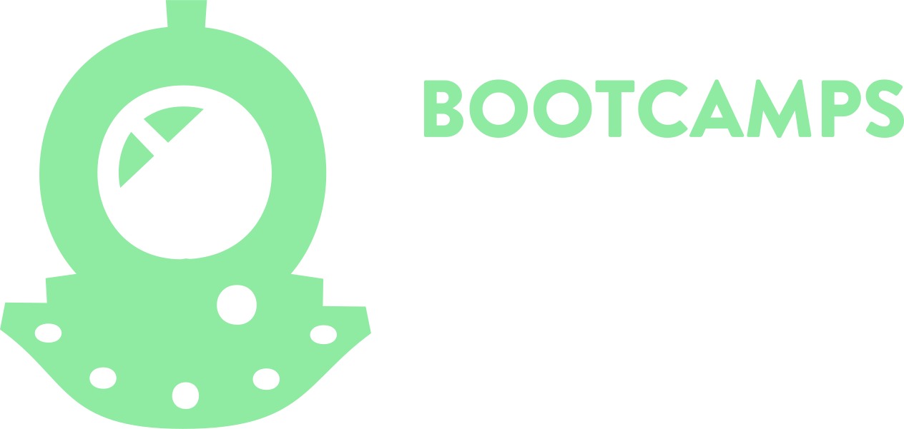

# Bootcamp Alura

Este repositório está destinado para as aulas e os desafios do [bootcamp de Data Science Aplicada](https://www.alura.com.br/bootcamp/data-science-aplicada/matriculas-abertas) promovido pela [Alura](https://www.alura.com.br/?gclid=Cj0KCQjwk4yGBhDQARIsACGfAeuYTHO_g-_o9gKWyOPdKHSMy3gyxGPmSRg-j8JK0rl6U5ilaC8lxpAaAuaQEALw_wcB), o bootcamp foi dividido em 5 módulos, e ao final de cada um é proposto um projeto final.

## Módulo 1 : Python e pandas para análise de dados reais
[Projeto Final](https://github.com/PedroHCAlmeida/Projeto_final_M1_bootcamp_alura)
## Módulo 2 : Visualização de dados com Seaborn e Matplotlib

## Módulo 3 : Análise de séries temporais

## Módulo 4 : Tratamento, análise e Machine Learning aplicado

## Módulo 5 : Modelos, métricas e validações em Machine Learning
